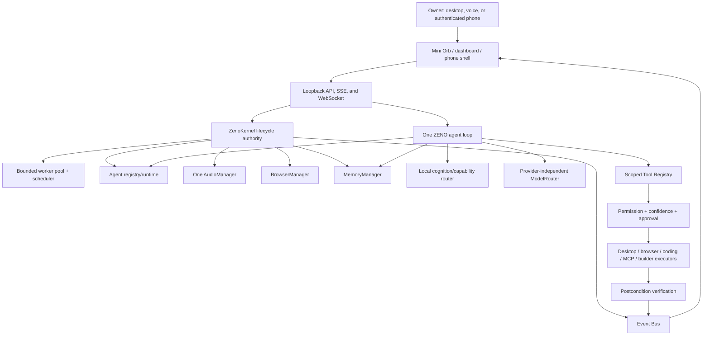

# ZENO Architecture V2

## Runtime graph

## Staged startup

1. **Immediate interface:** configuration, logging, shell, Mini Orb, Event Bus
   primitives, Kernel, bounded queue, and basic voice state.
2. **Core runtime:** executive loop, agent registry, mission/permission/model
   authorities, memory metadata, voice manager, and monitor providers are
   scheduled in the background.
3. **Lazy services:** browser contexts, plugins, optional models, OCR, vision,
   embeddings, knowledge rebuilds, research, coding, and external adapters
   start only after a matching request.

## One task lifecycle

`UNDERSTAND -> RETRIEVE_MEMORY -> PLAN -> SELECT_AGENT -> SELECT_TOOL ->
EXECUTE -> OBSERVE_RESULT -> VERIFY -> STORE_MEMORY -> RESPOND`

The lifecycle observes the existing executor; it is not another scheduler.
Recovery attempts, tool rounds, specialist depth, fan-out, queues, and
deadlines are bounded. Only explicit postcondition evidence yields a
completed/verified state.

## Resource ownership

| Resource | Single owner |
|---|---|
| microphone frames | `audio.manager.AudioManager` |
| wake state | `wake.engine.WakeEngine` |
| speech turns | shared voice session and agent loop |
| model calls | `provider` through `model_router` |
| agent workers | `agent_runtime` plus bounded `worker_pool` |
| browser context | `browser.session_manager` / `browser_runtime` |
| Windows actions | `computer.controller` and controlled executors |
| permissions | `permissions` + `security.policy` at `run_tool` |
| events | `event_bus` |
| durable memory | `memory.manager` with Living Memory fallback |

## Fault isolation

- Provider, STT, TTS, browser, agent, MCP, and optional-service failures use
  timeouts/circuit states and fallbacks without stopping the host.
- Slow Event Bus consumers cannot stall publishers indefinitely.
- WinRT notifications own one asyncio thread and no longer park a general
  worker.
- Shutdown rejects new tasks, stops schedules/listeners, closes browser/build
  children, flushes events, and then releases workers.

Third-party projects remain adapters behind these interfaces. They replace a
backend only after health, performance, license, permission, and regression
checks; they never become a second ZENO master runtime.
